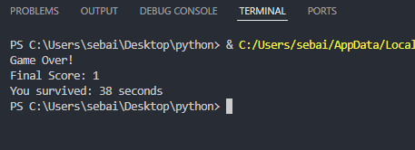

 Snake Game (Python)

A simple snake game built using Python and the `curses` library.

# Features

* Score system
* Timer (track how long you survived)
* Dynamic speed (game gets faster over time)

##  About

This project was built by following a tutorial, then improved by adding new features like score, timer, and dynamic speed.

# How to Run
python snake.py

##  Screenshot

